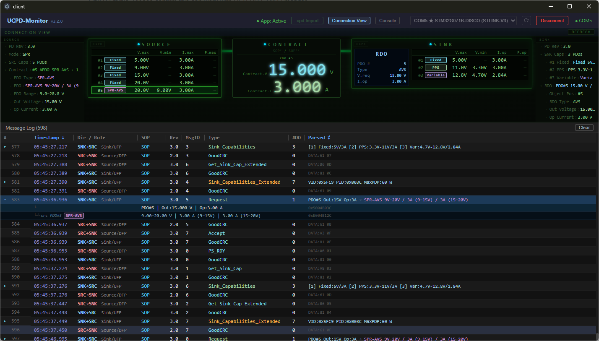

# UCPD-Monitor

[English](README.md) | [日本語](README.ja.md)

STM32 UCPD ハードウェアが生成する USB Power Delivery (PD) 通信のトレース情報をリアルタイムで監視・解析する Electron デスクトップアプリケーションです。

STM32CubeMonitor-UCPD が出力する `.cpd` バイナリストリームを読み込み、**USB PD Revision 3.2, Version 1.0 (2023-10)** 仕様に基づいてデコードします。ライブ接続ビュー、完全デコードされたメッセージテーブル、クリップボードへのエクスポート機能を提供します。

---

## 背景

STMicroelectronics の **STM32G071B-DISCO** は UCPD SPY モードを内蔵しており、CC ライン上の USB PD パケットを受動的にキャプチャし、コンパニオンツール **STM32CubeMonitor-UCPD**（USB PD 2.0/3.0 対応）経由で `.cpd` バイナリデータとして PC へストリーミングします。UCPD-Monitor は同じ `.cpd` ストリームを受け取り、**USB PD Rev 3.2** 準拠のパーサ（EPR・AVS・拡張メッセージ・Source_Info 等を網羅）でデコードします。トレース用途でSTM32CubeMonitor-UCPD は不要です。

> **参考:** [STM32CubeMonitor-UCPD (st.com)](https://www.st.com/en/development-tools/stm32cubemonucpd.html) · [RN0113 リリースノート](https://www.st.com/resource/en/release_note/rn0113-stm32cubemonitorucpd-release-140-stmicroelectronics.pdf)



---

## 機能

- **ライブシリアル監視** — STM32 UCPD デバイスを USB-UART で接続してリアルタイムに PD フレームを受信
- **`.cpd` ファイルインポート** — STM32CubeMonitor-UCPD が保存した `.cpd` バイナリファイルをドラッグ＆ドロップまたはファイル選択で再生。サーバサイド解析によりリングバッファの不整合なし。インポート前にライブログを自動クリアし、インポートデータはセッションファイルへ重複書き込みしない
- **USB PD Rev 3.2 デコーダ** — コントロール・データ・拡張メッセージを完全デコード。EPR / PPS / AVS に対応
- **Connection View** — Source / Cable (eMarker) / Sink の接続状態・PDO 能力・電力契約をビジュアル表示。PS_RDY 確定後は SOURCE ノードに出力電圧・電流／電力を表示。SINK ノードには **V.req**（要求電圧）と計算電力を表示。PDO グリッドは Source PDO に `I.max` / `P.max`、Sink PDO に `I.op` / `P.op` を表示（USB PD Rev 3.2 準拠）
- **メッセージテーブル** — [@tanstack/react-virtual](https://tanstack.com/virtual) による高性能仮想スクロールは 1,000 行超でもスムーズ。PDO/RDO 子行展開・O(n) RDO → Source PDO 逆引き。列幅をユーザーがドラッグリサイズ可能。最右列「Parsed」はウィンドウ幅いっぱいに自動伸長し、ツリー展開・ウィンドウリサイズ時も安定
- **行選択＆クリップボードコピー** — クリック/Shift+クリックで範囲選択、Ctrl+C または右クリックで TSV コピー（`DATA:HEX` RAW データ付き）
- **自動スクロール＆最新へジャンプ** — 最新メッセージへ自動追従。手動スクロール後はフローティングボタンで復帰
- **セッションファイル自動保存** — ライブデータをタイムスタンプ付き `.cpd` ファイルへ自動保存。後でそのまま再インポート可能。アプリ終了時にシリアルポートを安全に切断してセッションファイルをフラッシュ
- **不明パケットログ** — パース不能なフレームを `logs/unknown_packets.yaml` へ記録
- **パネルトグル** — Connection View/コンソールパネルを個別に表示/非表示

---

## 技術スタック

| コンポーネント | 技術 |
|---|---|
| デスクトップシェル | Electron 41 |
| UI フレームワーク | React 19 + Vite 8 |
| 状態管理 | Zustand |
| 仮想スクロール | @tanstack/react-virtual |
| バックエンド | Express 4 + Node.js |
| リアルタイム通信 | WebSocket (`ws`) |
| シリアル通信 | `serialport` 13 |
| パッケージング | electron-builder |

---

## セットアップ

[Releases](https://github.com/aso/UCPD-Monitor/releases) ページから最新のインストーラをダウンロードして実行してください。

| プラットフォーム | ファイル |
|---|---|
| Windows | NSIS インストーラ (`.exe`) |
| Linux | AppImage |

インストール完了後、**UCPD-Monitor** を起動してください。

---

## 使い方

### デバイスへの接続

1. STM32 UCPD デバイス(STM32G071B-DISCO)を USB ポートに接続する
2. タイトルバーのドロップダウンから COM ポートを選択する
3. **Connect** をクリックする → リアルタイムで PD フレームが表示される

### `.cpd` ファイルのインポート

- タイトルバーの **.cpd Import** ボタンをクリック、または
- ウィンドウ上に `.cpd` ファイルをドラッグ＆ドロップする

ファイル全体がサーバサイドで解析され `HISTORY` メッセージとして再生されます。DETACHED/ATTACHED イベントはそのまま保持され、リングバッファによる切り捨ては発生しません。

### メッセージのコピー

1. 行をクリックして選択。Shift+クリックで範囲選択。
2. **Ctrl+C** を押すか、右クリックして **Copy N rows** を選ぶ。

各行はタブ区切り（TSV）でコピーされます:

```
#id   Timestamp   Dir   SOP   Rev   MsgID   Type   #DO   Parsed Summary   DATA:HEXRAW
```

パース済サマリがない行は、サマリカラムに `DATA:HEXRAW` 形式で生データを表示します。

---

## 対応 PD メッセージ

### コントロールメッセージ
GoodCRC, Accept, Reject, PS_RDY, Soft_Reset, Hard_Reset, DR_Swap, PR_Swap, VCONN_Swap, Wait, Not_Supported, Get_Source_Cap, Get_Sink_Cap, Get_Source_Cap_Extended, Get_Status, FR_Swap, Get_PPS_Status, Data_Reset、および EPR 拡張コントロールメッセージ等

### データメッセージ
Source_Capabilities, Sink_Capabilities, Request, EPR_Request, BIST, Alert, Battery_Status, Get_Country_Info, Enter_USB, EPR_Mode, Source_Info, Revision, VDM (Structured)

### 拡張メッセージ
Source_Capabilities_Extended (SCEDB), Status, PPS_Status, Battery_Capabilities, Manufacturer_Info, Sink_Capabilities_Extended, Country_Info, Country_Codes, Security_*, Firmware_Update_*, Extended_Control

### PDO / RDO 種別
Fixed, Variable, Battery, APDO (PPS), APDO (AVS), APDO (SPR-AVS) — 全フィールド完全デコード。
- Source PDO は **I.max** / **P.max**、Sink PDO は **I.op** / **P.op** を表示（USB PD Rev 3.2 準拠）
- Battery RDO は 250 mW 単位の電力フィールド (`opPower_mW` / `limPower_mW`) を保持
- GiveBack フラグにより RDO 子行の Max/Min ラベルを動的切替

---

## ドキュメント

詳細なシステム設計・API・データフロー・状態機械の仕様については [docs/SPEC.md](docs/SPEC.md) を参照してください。

---

## ライセンス

MIT — 詳細は [LICENSE](LICENSE) を参照してください。

---

## 関連リンク

- [STM32CubeMonitor-UCPD](https://www.st.com/en/development-tools/stm32cubemonitor-ucpd.html) — STMicroelectronics 公式モニタリングツール
- [USB Power Delivery Specification Rev 3.2](https://www.usb.org/document-library/usb-power-delivery)
